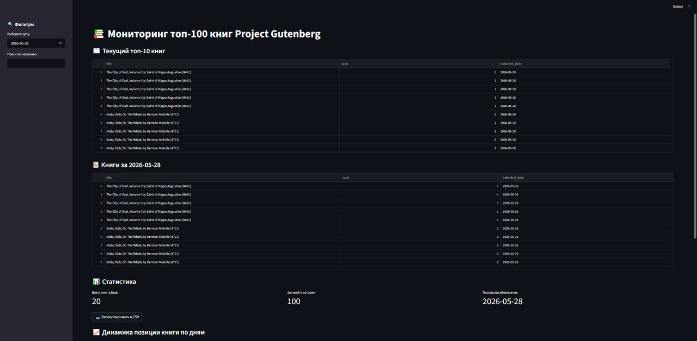
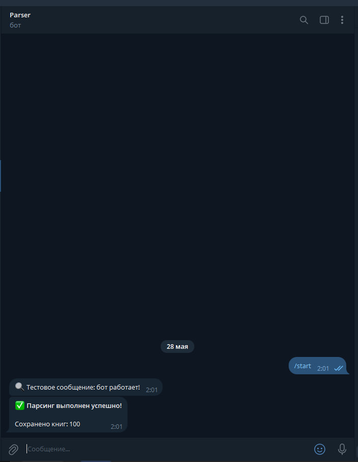
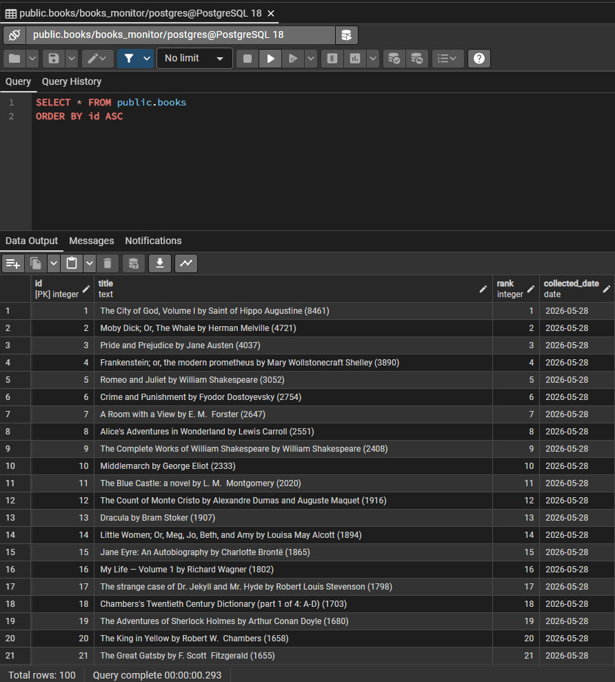

# Автоматический мониторинг топ-100 книг с дашбордом и Telegram-уведомлениями

## 📌 Задача бизнеса
Клиенту нужно ежедневно отслеживать позиции книг в топе, видеть динамику и получать уведомления об изменениях.  
Ручной сбор данных занимает часы и не даёт истории.

## 🛠 Что сделано
Разработана полностью автоматическая система:

| Модуль | Технологии | Что делает |
|--------|------------|------------|
| Парсинг | Python, BeautifulSoup, requests | Собирает топ-100 книг с Project Gutenberg |
| Хранение | PostgreSQL, psycopg2 | Сохраняет данные с историей изменений |
| Автоматизация | Планировщик Windows (schtasks) | Запускает парсер каждый день в 9:00 |
| Визуализация | Streamlit | Дашборд с таблицами, графиками, фильтрами |
| Уведомления | Telegram Bot API | Присылает отчёт об успехе или ошибке |
| Установка | setup.bat (одна команда) | Автоматически настраивает всё окружение |

## 📊 Результат

✅ Данные обновляются без участия человека  
✅ История изменений сохраняется в БД  
✅ Дашборд с поиском, фильтром по дате и графиком динамики  
✅ Экспорт в CSV/Excel одной кнопкой  
✅ Telegram-уведомления после каждого запуска  
✅ Установка одной командой — клиенту не нужно ничего настраивать вручную  

## 🖼 Скриншоты

| Дашборд | Telegram | Планировщик |
|---------|----------|-------------|
|  |  |  |

## 🚀 Демонстрация
Рабочий проект — в папке `demo/`.  
Запустите `setup.bat` (один раз), затем `start_dashboard.bat`.

## 💰 Стоимость аналогичного решения под ваш источник данных
- **Базовый парсинг** (Excel): от 15 000 ₽
- **Парсинг + БД + дашборд** (как этот кейс): от 45 000 ₽
- **+ автозапуск + уведомления**: от 65 000 ₽

Точная цена зависит от сложности сайта (нужна ли авторизация, капча, обход блокировок).

## 📬 Контакты
Телеграм: @Kazakovgennn  
Email: kazakovgennn@mail.ru
